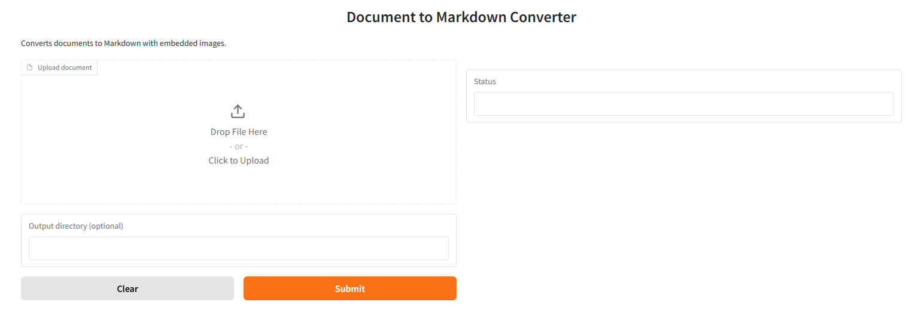

# Document to Markdown Converter
=============================

Convert documents (PDF, DOCX, etc.) to Markdown format with embedded images. Supports both command-line usage and web-based interface via Gradio.

Features
--------
- 📄 Converts PDF, DOCX, and other formats to Markdown
- 🖼️ Extracts and embeds images from documents into Markdown
- 🖥️ Web-based interface using Gradio
- 🛠️ Command-line interface for automation
- 📦 Docker containerization for easy deployment

Installation
------------
### Prerequisites
- Python 3.8+
- Pandoc (for non-PDF formats) 

### Install Dependencies
Open a command prompt or terminal and type:
```
pip install -r requirements.txt
```

requirements.txt contents:

```
gradio
pymupdf
```
### Pandoc Installation Guide

### Linux

#### Ubuntu/Debian
Open a terminal and type:
```
sudo apt update
sudo apt install pandoc
```
#### CentOS/Fedora
```
sudo dnf install pandoc
```
### macOS
Using Homebrew
Open a terminal and type:
```
brew install pandoc
```
### Windows

Using Chocolatey

Open a command prompt as administrator and type:

```
choco install pandoc
```
#### Manual Installation

Download the installer from the Pandoc releases page
Run the installer and follow the prompts

Verify installation by opening a command prompt and typing:

```
pandoc --version
```
### Usage

#### Command-Line Interface

Run the converter by opening a command prompt or terminal and typing:
```
python convert_to_markdown.py input_file output_directory
```
Example:
```
python convert_to_markdown.py example.pdf ./output
```

#### Web Interface (Gradio)
Start the application by opening a command prompt or terminal and typing:

```
python app.py
```
Open your web browser and go to http://localhost:7860

### How It Works
Upload a document (PDF, DOCX, etc.)
The application extracts text and images
Converts content to Markdown format
Embeds images as base64 data URIs
Displays preview with embedded images

UI preview:


*Document converter interface built with Gradio*

### Troubleshooting

#### Missing Dependencies
Install Pandoc:

Linux: sudo apt install pandoc

macOS: brew install pandoc

Windows: Use Chocolatey or manual install

Image Embedding Issues

Ensure output directory has write permissions

Verify image formats are supported (PNG, JPEG, etc.)

### Advanced Usage
#### Custom Output Directory

Open a command prompt or terminal and type:

```
python convert_to_markdown.py input_file custom_output_directory
```

### Docker Deployment
Build Docker image by opening a command prompt or terminal and typing:

```
docker build -t markdown-converter .
```
Run Docker container by opening a command prompt or terminal and typing:

```
docker run -v "$(pwd)/output":/app/output markdown-converter
```
### Contributing
Fork the repository
Create a feature branch
Commit changes
Submit pull request

### License
This project is licensed under the MIT License. See the LICENSE file for details.
